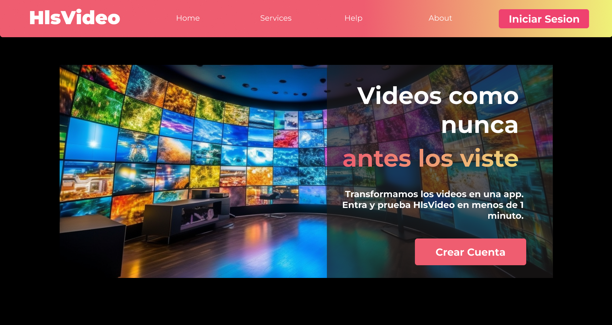

# HLS service test demo

### Frontend Design

- [figma](https://www.figma.com/file/KnBDgGpW5ZaOzzh4hD6X9t/ZappingTest?type=design&node-id=0%3A1&mode=design&t=htHvUseiQqDHiRJD-1)

### Image

</img>

## Description

This is a demo to test a HLS service.
It uses a golang server to serve the HLS files and a next.js app to handle the user interactions.
The golang API handles all HTTP requests and allows users to log in using JWT auth and serves the HLS files.
The next.js app to handle the user interactions, such as:

- create account
- login
- logout
- list of available videos
- video player

### Requirements

- docker to run the containers

- golang
- node.js
- yarn

### How to run with docker

- `docker compose build`
- `docker compose up`

### How to run without docker

- On one terminal, run `cd ./backend` and run `go run .` for the golang server
- On another terminal, run `cd ./frontend` and run `yarn dev` for the next.js app
